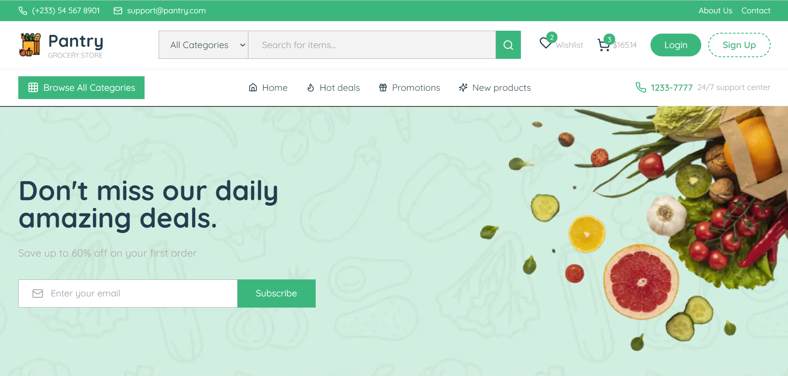

# 🛒 Pantry - Your Ultimate Grocery E-Commerce Store

Welcome to **Pantry**, a modern, scalable, and feature-rich grocery e-commerce platform built with **Next.js**, **Tailwind CSS**, **tRPC**, **Prisma**, and **Clerk**. Pantry is designed to provide a seamless shopping experience for users while showcasing best practices in modern web development.

---

## 🚀 Features

### User Experience

- **Sleek & Responsive Design** – Modern UI with seamless cross-device experience
- **Dynamic Search & Filters** – Easily find products by category or search terms
- **Detailed Product Views** – Rich product information with high-quality images
- **Wishlist Management** – Save favorite items for future purchase

### Shopping Experience

- **Dynamic Shopping Cart** – Add/remove items with real-time updates and a dynamic cart count
- **Secure Checkout** – Integrated with Stripe for safe and reliable payment processing
- **Order Management** – Track order status and view order history
- **Multiple Payment Options** – Support for various payment methods through Stripe

### Security & Authentication

- **Secure Authentication** – Powered by Clerk for seamless sign-in, sign-up, and user management
- **Role-Based Access** – Differentiate between customers and admins with role-based access control
- **Protected Routes** – Secure endpoints and pages based on user authentication

### Technical Features

- **Type-Safe APIs** – Built with tRPC for end-to-end type safety and seamless backend communication
- **Scalable Database** – Leverages Prisma and NeonDB for reliable and scalable data storage
- **Optimized Performance** – Next.js Image Optimization and server-side rendering for fast load times
- **Real-time Updates** – Instant cart and wishlist updates without page refreshes

---

## 🛠️ Tech Stack

- **Frontend**: Next.js, Tailwind CSS, tRPC, Clerk
- **Backend**: Prisma, NeonDB, tRPC
- **Tools**: TypeScript, Faker.js, Next.js Image Optimization

---

## 🚀 Getting Started

### Prerequisites

- Node.js (v18 or higher)
- PostgreSQL (or NeonDB for serverless PostgreSQL)

### Installation

1. Clone the repository:

   ```bash
   git clone https://github.com/bismarkagyare/pantry.git
   cd pantry
   ```

2. Install dependencies:

   ```bash
   npm install
   ```

3. Set up environment variables:

   - Create a `.env` file in the root directory
   - Add the following variables:

   ```env
   DATABASE_URL="your-database-url"
   NEXT_PUBLIC_CLERK_PUBLISHABLE_KEY="your-clerk-publishable-key"
   CLERK_SECRET_KEY="your-clerk-secret-key"
   STRIPE_SECRET_KEY="your-stripe-secret-key"
   STRIPE_WEBHOOK_SECRET="your-stripe-webhook-secret"
   ```

4. Run the development server:

   ```bash
   npm run dev
   ```

5. Open [http://localhost:3000](http://localhost:3000) with your browser to see the result.

## 📸 Screenshots

### Home Page



<!-- ### Product Catalog


### Cart Page

 -->

## 📄 License

This project is licensed under the MIT License. See the LICENSE file for details.

## Learn More

To learn more about Next.js, take a look at the following resources:

- [Next.js Documentation](https://nextjs.org/docs) - learn about Next.js features and API.
- [Learn Next.js](https://nextjs.org/learn) - an interactive Next.js tutorial.

You can check out [the Next.js GitHub repository](https://github.com/vercel/next.js) - your feedback and contributions are welcome!

## Deploy on Vercel

The easiest way to deploy your Next.js app is to use the [Vercel Platform](https://vercel.com/new?utm_medium=default-template&filter=next.js&utm_source=create-next-app&utm_campaign=create-next-app-readme) from the creators of Next.js.

Check out our [Next.js deployment documentation](https://nextjs.org/docs/app/building-your-application/deploying) for more details.
